# Entorno de Desarrollo - Seminario Laravel con enfoque RAD

Este repositorio contiene la configuración base del entorno de desarrollo usando **Docker**. 
Con solo unos comandos se tendrá un servidor web (PHP 8.2), una base de datos (MariaDB) y phpMyAdmin funcionando en la máquina local, sin necesidad de instalar XAMPP ni WAMP.

---

## Requisitos previos

1. **Docker Desktop** (con el backend de WSL2 activado si usas Windows).  
   [Descargar Docker Desktop](https://www.docker.com/products/docker-desktop/)
2. **Git** (para clonar el repositorio).
3. **Visual Studio Code** (recomendado) con la extensión "Remote - Containers" o "Dev Containers" (opcional).

---

## Paso a paso para levantar el entorno

### 1. Clonar el repositorio
Abrir la terminal (WSL2 / PowerShell / Bash) y ejecuta:
```bash
git clone https://github.com/jamescanos/SeminarioLaravel.git
cd SeminarioLaravel
```

### 2. Estructura Inicial
Dentro de la carpeta, crea una carpeta llamada src
```bash
mkdir src
```

### 3. Levantar los contenedores
Ejecutar el siguiente comando en la raíz del proyecto (donde está el docker-compose.yml):
```bash
docker-compose up -d
```
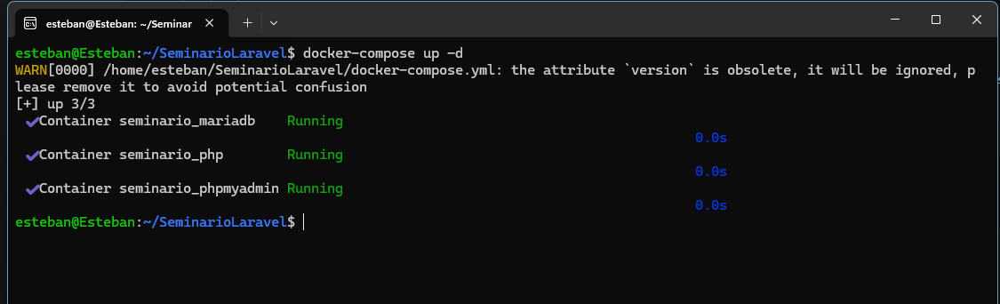


El flag -d significa "detached" (corre en segundo plano). Si se desean ver los logs en vivo, se quita el -d.

### 4. Verificar que todo funciona
PHP/Apache: Abrir el navegador y acceder a http://localhost:8090. 
```
Se debe ver página de información de PHP (phpinfo()).
```
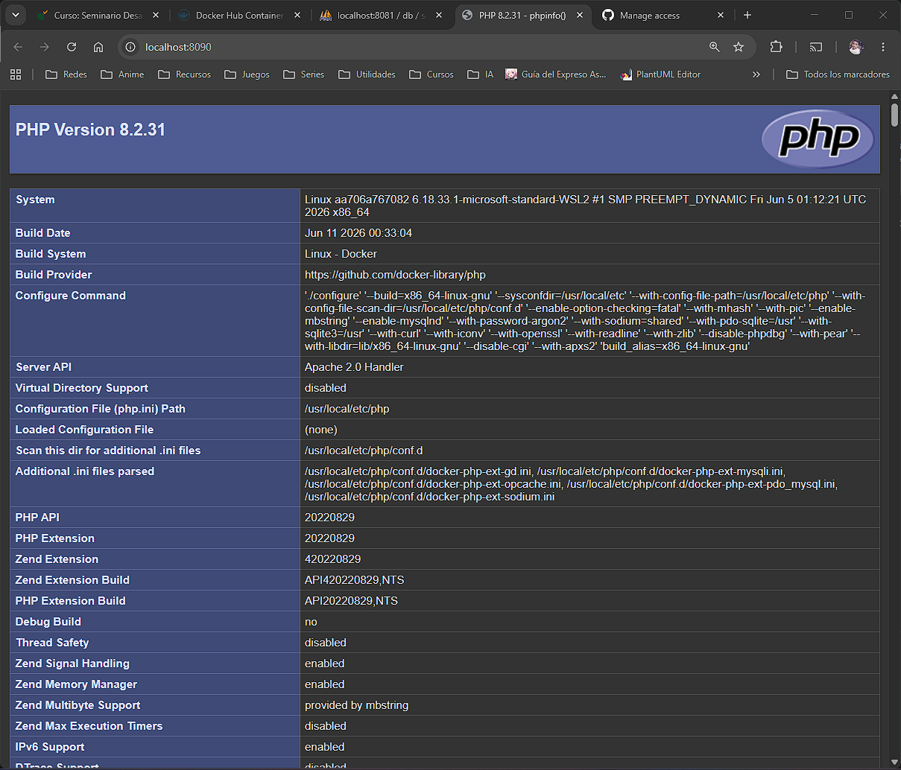

phpMyAdmin: Acceder a http://localhost:8081. 
```
Usuario: root, Contraseña: root_password.
```

Base de datos: conectarse desde phpMyAdmin o desde su código PHP usando:

```
   Host: db (el nombre del servicio en el compose)
   Usuario: root (o dev_user)
   Contraseña: root_password (o dev_password)
   Base de datos: seminario_db
```

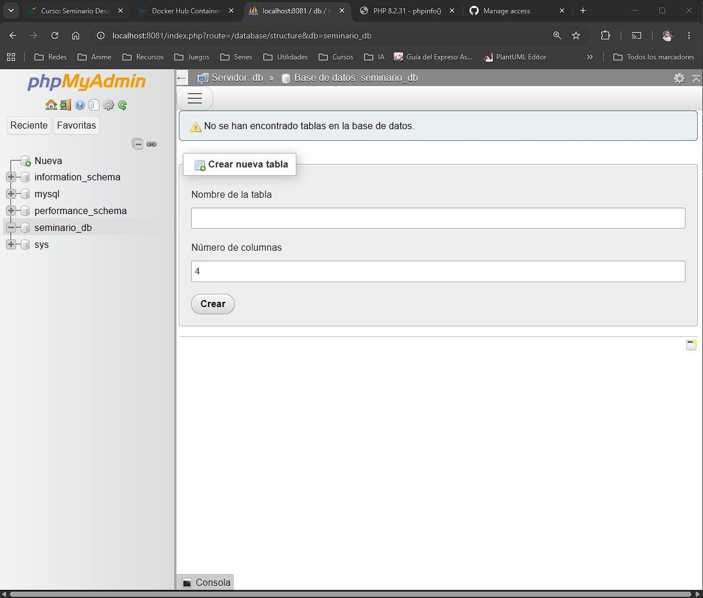

### 5. Sintaxis
Sintaxis: Abrir el navegador y acceder a http://localhost:8090/Sintaxis/Sintaxis.php

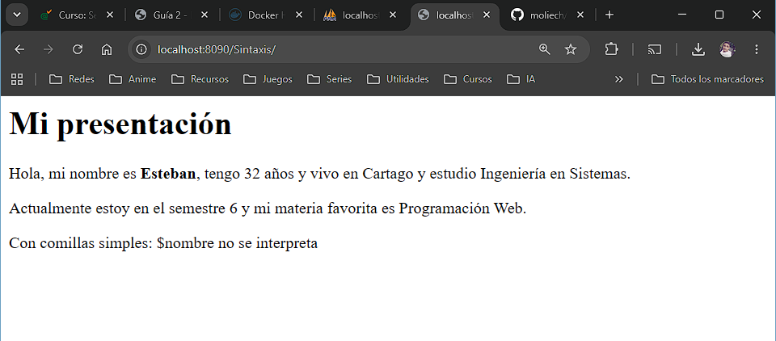

### 6. Arrays
Arrays: Abrir el navegador y acceder a http://localhost:8090/Sintaxis/array.php

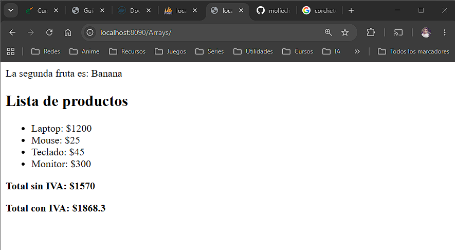

### 7. Funciones
Funciones: Abrir el navegador y acceder a http://localhost:8090/Sintaxis/funciones.php
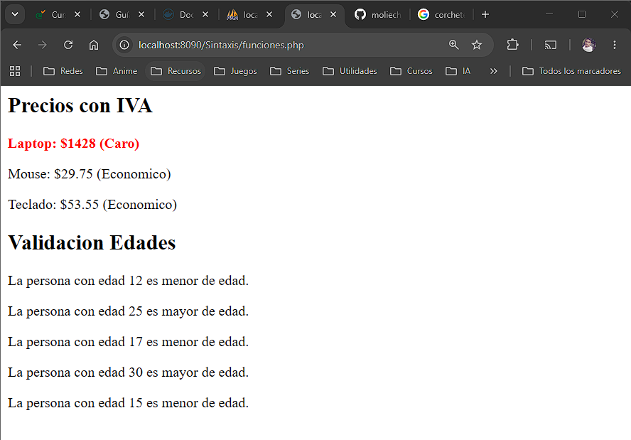

### 8. Formularios GET y POST
Abrir el navegador y acceder a http://localhost:8090/Sintaxis/formulario.php

#### GET
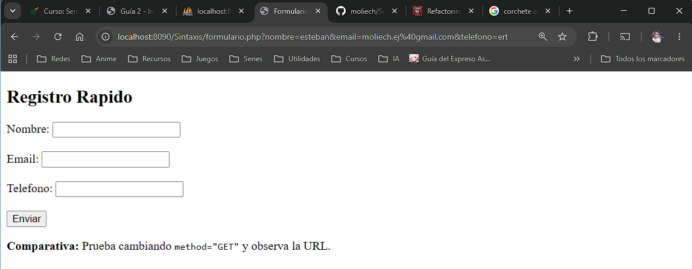

#### POST
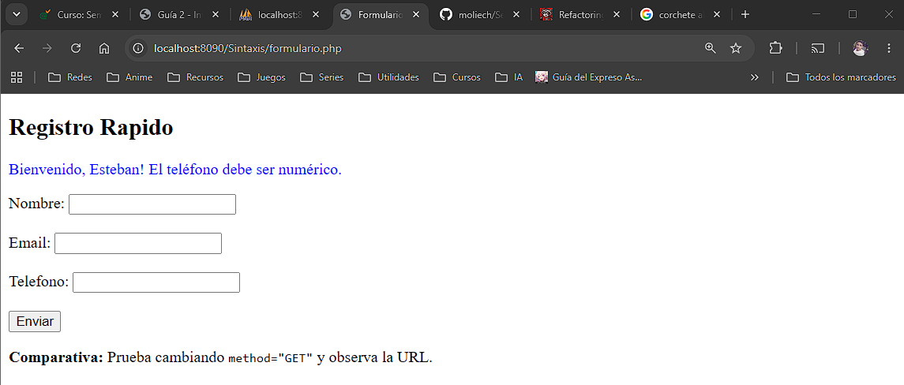

### 9. Introduccion POO (clases y Objetos)
Abrir el navegador y accedes a http://localhost:8090/POO/
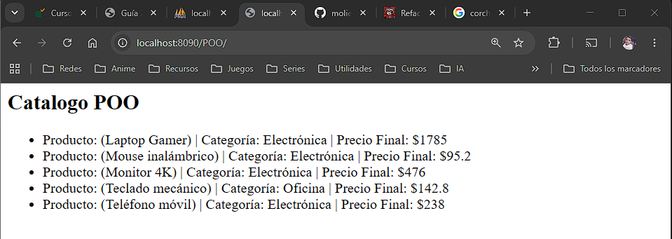

### 10. BD en Workbench
Se crea el diagrama en Workbench y se carga en phpMyAdmin
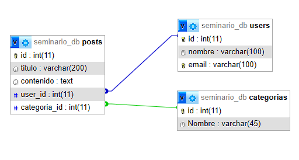

### 11. Conexion PDO con Singleton
Abrir el navegador y acceder a http://localhost:8090/test_db.php
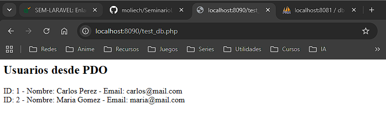

### 12. Creación del Modelo (M) con CRUD
Abrir el navegador y acceder a http://localhost:8090/test_model.php
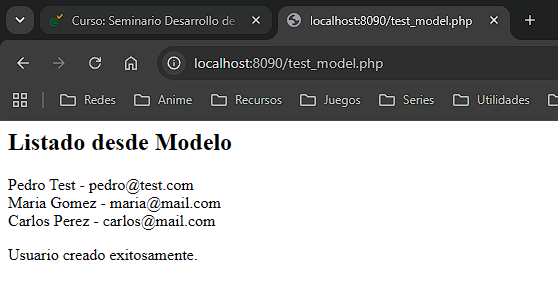